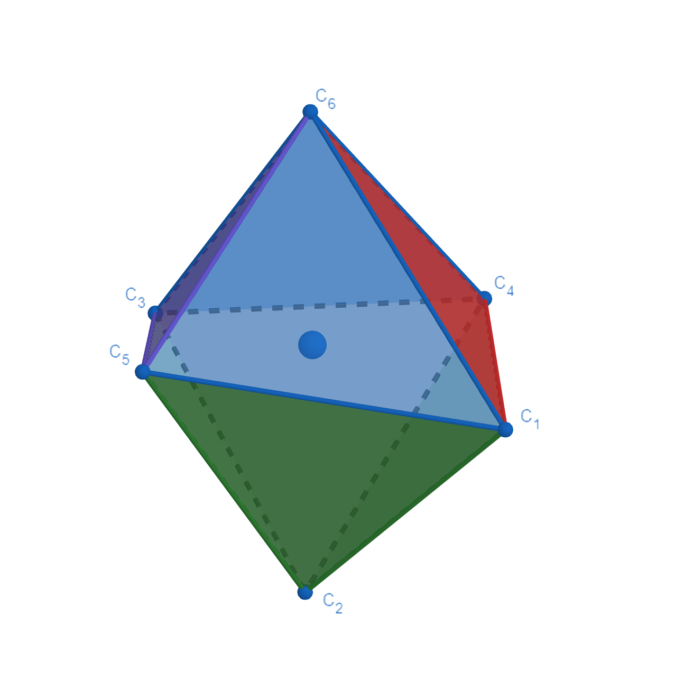

[back to homepage](./)

## About OctaDist
***
### Background
Octahedral complex can be simply classified into two types: regular and distorted octahedrons. The complexes with regular octahedral geometry or perfect octahedron are expected to form, when all of the ligands are of the same kind. In contrast, if the ligands are of different kinds, the complex would turns the distorted octahedron instead. Octahedral distortion parameters has been widely used for determining the change of the distortion of the complexes. Even though the people in community generally compute the octahedral distortion parameters for their complexes, but they not used a certain way to do this. Moreover, there is no software for determining this kind of parameter yet. Therefore, we present the OctaDist program as a choice for those who are interested in this.

### Octahedral distortion parameters
Octahedral distortion parameters contain three parameters: , , and . The following just explains how to compute these three parameters, especially we use our new method to compute the  parameter. Please refer to [References](#references) for more details.  

Calculation of the  and  parameters are straightforward. The  is the avearge of the sum of the deviation of LG-M distance, where LG and M are ligand atom and metal center atom, from mean distance. The  is the sum of LG-M-LS angle (  ) from the 90 degree.  

The  parameter is the sum of the deviation of 24 unique LG-M-LG angles () from 60 degree, where  is computed on the orthogonal projection of two twisting triangular faces of the octahedron projected along its pseudo-threefold axes onto the medium plane that containing metal center. However, in reality, becuase of the complex is distorted, the symmetry is changed, so the medium plane between two opposite faces cannot be determined directly. To solve this, we propose a new method to find the optimal 4 faces and use orthogonal vector projection for computing the unique () angles on twisting triangular faces, and for finding the most reasonable  parameter.

Mathematical expression of three parameters are given by following equations

  

  

  

To determine the distortion parameters, OctaDist firstly find the optimal 4 faces out of 8 faces of octahedral complexes. The total number of combination of faces is 70. OctaDist then computes the 24 unique () angles for all 70 sets. Therefore, a distorted octahedral structure has 70 different values of  parameter. The lowest  is chosen for representing the deviation of a distorted complex from perfect octahedral structure.

**Graphical representation of orthogonal projection and twisting triangular faces**

|Distorted octahedron | Orthogonal projection of atoms onto the given (opposite) plane | The  angle between the atom vectors defined by two twisting triangular faces|
|:-------------------------:|:-------------------------:|:-------------------------:|
| |  | |

### References
1. [J. A. Alonso, M. J. Martı´nez-Lope, M. T. Casais, M. T. Ferna´ndez-Dı´az. Inorg. Chem. 2000, 39, 917-923](https://pubs.acs.org/doi/abs/10.1021/ic990921e)
2. [J. K. McCusker, A. L. Rheingold, D. N. Hendrickson. Inorg. Chem. 1996, 35, 2100-2112](https://pubs.acs.org/doi/abs/10.1021/ic9507880)
3. [M. Marchivie, P. Guionneau, J. F. Letard, D. Chasseau. Acta Crystal-logr. Sect. B Struct. Sci. 2005, 61, 25-28](https://onlinelibrary.wiley.com/doi/full/10.1107/S0108768104029751)

 

[back to homepage](./)
