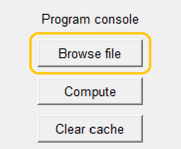
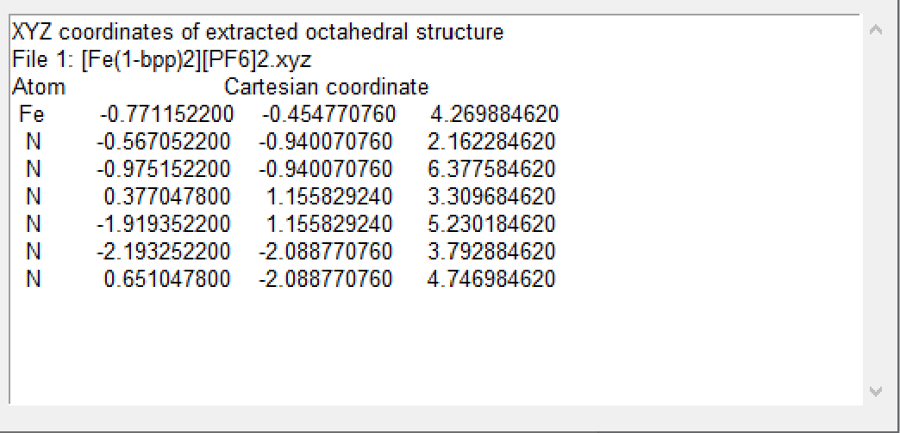
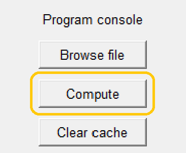
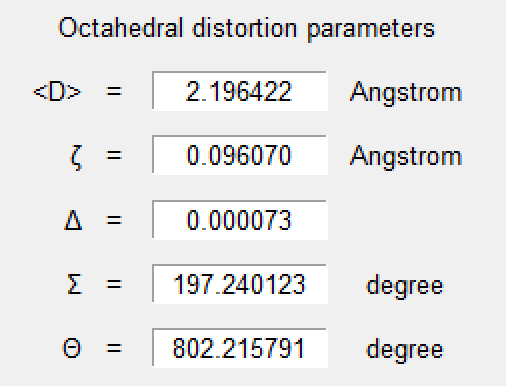
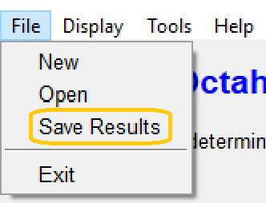

[back to homepage](./) | [manual](./manual.md)


## Computing the parameters
***

This section shows how OctaDist can be used for computing the distortion parameters step by step.
OctaDist has two versions based on purpose of use: a graphical user interface (GUI) and command line interface (CLU).
The former is designed for the end-user who do not familiar with command lines, 
while the latter is for Linux (and Mac) users, especially the developer who want to implement OctaDist into their software. 

- [OctaDist - GUI](#octadist---gui)
- [OctaDist - CLI](#octadist---cli)

***

### OctaDist - GUI

1. Click **`Browse file`**, choose one or multiple input files, then click **`Open`**.

    <p align="center">
    
    <p/>
   
2. OctaDist will check file format and extract atomic coordinates, and show the data on a result box.

    <p align="center">
    
    <p/>

3. If yes, then click **`Compute`**.

    <p align="center">
    
    <p/>

4. The computed parameters will be shown in output box.

    <p align="center">
    
    <p/>

5. To save the results, click **`File`**, then **`Save results`**.

    <p align="center">
    
    <p/>

### OctaDist - CLI

Example scripts are available at [here](https://github.com/OctaDist/OctaDist-PyPI/tree/master/example-py).

1. Install OctaDist using  **`pip`** (see above).

2. Prepare lists of atomic labels and coordinates of octahedral structure

    ```
    atom = ['Fe', 'O', 'O', 'N', 'N', 'N', 'N']
    
    coor = [[2.298354000, 5.161785000, 7.971898000],
            [1.885657000, 4.804777000, 6.183726000],
            [1.747515000, 6.960963000, 7.932784000],
            [4.094380000, 5.807257000, 7.588689000],
            [0.539005000, 4.482809000, 8.460004000],
            [2.812425000, 3.266553000, 8.131637000],
            [2.886404000, 5.392925000, 9.848966000]]
    ```

    or you can use **`extract_octa`** method in **`coord`** module to open and read input file at the same time, it will also extract the octahedral structure from full complex.
    For example, input file **`full/path/of/input/file/Multiple-metals.xyz`**
    (other example input files are available at [here](https://github.com/OctaDist/OctaDist-PyPI/tree/master/example-input)):
    
    ```
    from octadist import coord
    
    file = r"full/path/of/input/file/Multiple-metals.xyz"
    atom, coor = coord.extract_octa(file)
    ```
    
3.  Import **`calc`** module for computing the octahedral distortion parameters:
    
    ```
    from octadist import calc
    ```
    
4.  Use **`calc_all`** method Calculate all octahedral parameters

    ```
    d_mean, zeta, delta, sigma, theta = calc.calc_all(atom, coor)
    ```

5.  Print all computed parameters:
    
    ```
    All computed parameters
    -----------------------
    Zeta  = 0.22807256171728651
    Delta = 0.0004762517834704151
    Sigma = 47.926528379270124
    Theta = 122.688972774546
    ```

[back to homepage](./) | [manual](./manual.md)
