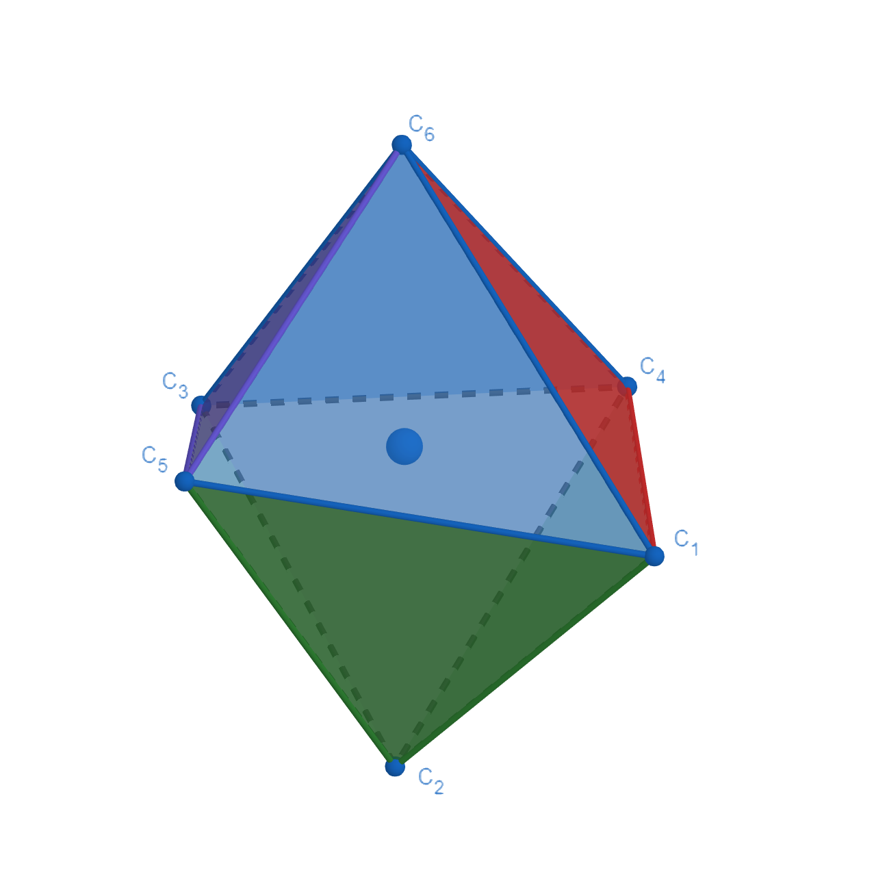
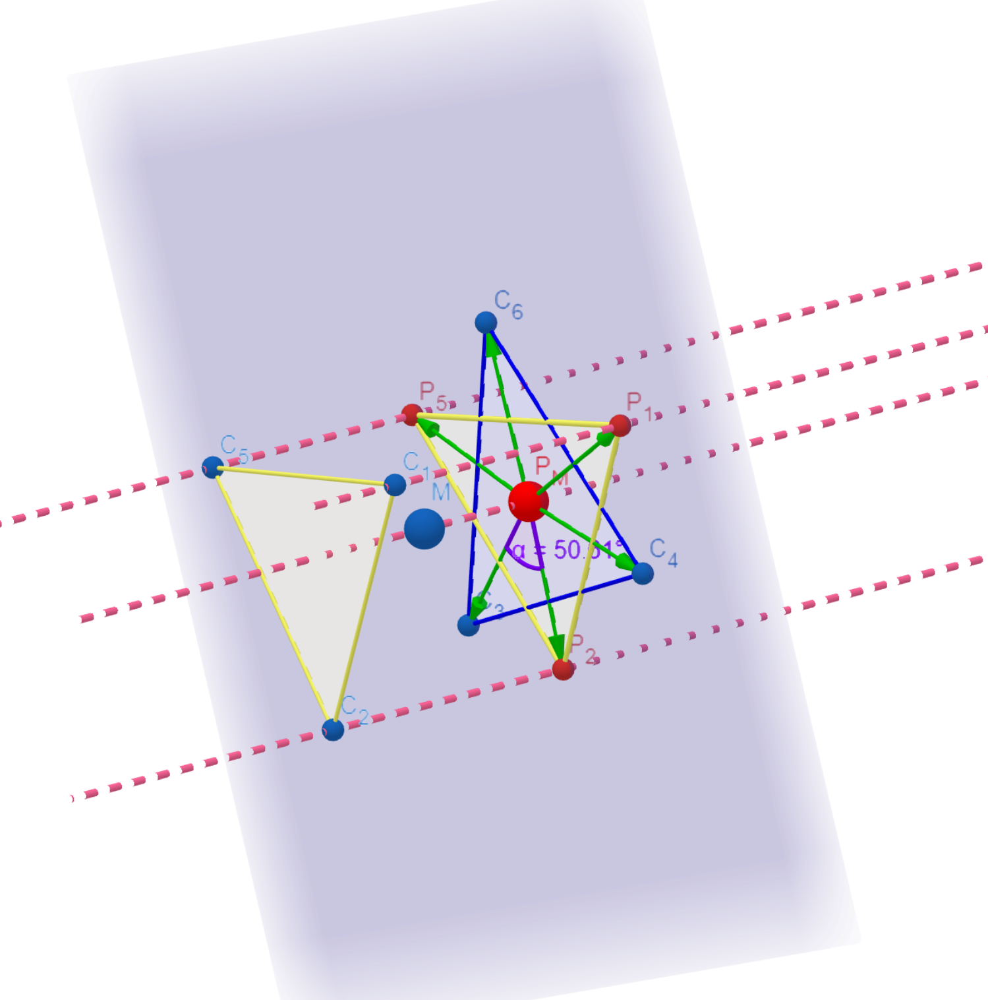
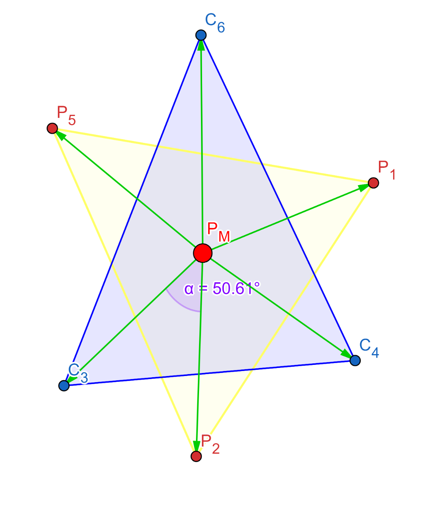

[back to homepage](./) | [manual](./manual.md)

## Distortion parameters
***

[Delta]: https://latex.codecogs.com/svg.Latex?%5CDelta
[phi]: https://latex.codecogs.com/svg.Latex?%5Cphi
[Sigma]: https://latex.codecogs.com/svg.Latex?%5CSigma
[theta]: https://latex.codecogs.com/svg.Latex?%5Ctheta
[Theta]: https://latex.codecogs.com/svg.Latex?%5CTheta

Octahedral distortion parameters contain three parameters: 
![][Delta], ![][Sigma], and ![][Theta]. 
The following explains the way that OctaDist uses to calculate these distortion parameters. , especially we use our new method to compute the  parameter. 
Please refer to [References](#references) for more details.  

Calculation of the ![][Delta] and 
![][Sigma] parameters are straightforward. 
The ![][Delta] is the average of the sum of the deviation of LG-M distance, where LG and M are ligand atom and metal center atom, from mean distance. 
The ![][Sigma] is the sum of LG-M-LS angle ( ![][phi] ) from the 90 degree.  

The ![][Theta] parameter is the sum of the deviation of 24 unique LG-M-LG angles ( ![][theta] ) from 60 degree, 
where ![][theta] is computed on the orthogonal projection of two twisting triangular faces of the octahedron projected along its pseudo-threefold axes onto the medium plane that containing metal center. 
However, in reality, due to the complex is distorted, the symmetry is changed, so the medium plane between two opposite faces cannot be determined directly. To solve this, we propose a new method to find the optimal 4 faces and use orthogonal vector projection for computing the unique () angles on twisting triangular faces, and for finding the most reasonable  parameter.

Mathematical expression of three parameters are given by following equations

  

  

  

To determine the distortion parameters, OctaDist firstly find the optimal 4 faces out of 8 faces of octahedral complexes. The total number of combination of faces is 70. OctaDist then computes the 24 unique () angles for all 70 sets. Therefore, a distorted octahedral structure has 70 different values of  parameter. The lowest  is chosen for representing the deviation of a distorted complex from perfect octahedral structure.

**Graphical representation of orthogonal projection and twisting triangular faces**

|Distorted octahedral complex | Orthogonal projection of atoms onto the opposite face | The ![][theta] (dihedral) angle between the atom vectors defined by two twisting triangular faces|
|:-------------------------:|:-------------------------:|:-------------------------:|
| |  | |

### References

1. [M. Buron-Le Cointe, J. H´ebert, C. Bald´e, N. Moisan, L. Toupet, P. Guionneau, J. F. L´etard, E. Freysz, H. Cailleau, E. Collet. Physical Review B 2012, 85, 064114][ref1]
2. [J. A. Alonso, M. J. Martı´nez-Lope, M. T. Casais, M. T. Ferna´ndez-Dı´az. Inorg. Chem. 2000, 39, 917-923][ref2]
3. [J. K. McCusker, A. L. Rheingold, D. N. Hendrickson. Inorg. Chem. 1996, 35, 2100-2112][ref3]
4. [M. Marchivie, P. Guionneau, J. F. Letard, D. Chasseau. Acta Crystal-logr. Sect. B Struct. Sci. 2005, 61, 25-28][ref4]

[ref1]: https://journals.aps.org/prb/abstract/10.1103/PhysRevB.85.064114
[ref2]: https://pubs.acs.org/doi/abs/10.1021/ic990921e
[ref3]: https://pubs.acs.org/doi/abs/10.1021/ic9507880
[ref4]: https://onlinelibrary.wiley.com/doi/full/10.1107/S0108768104029751

[back to homepage](./) | [manual](./manual.md)
