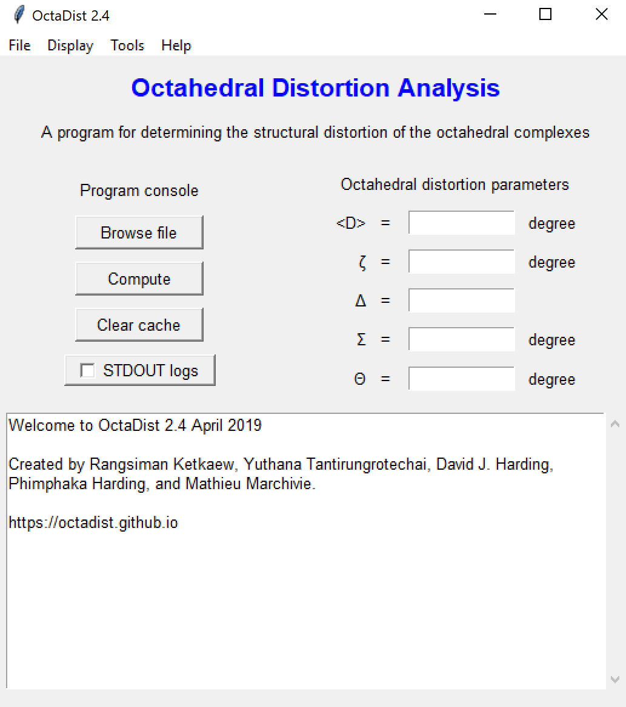
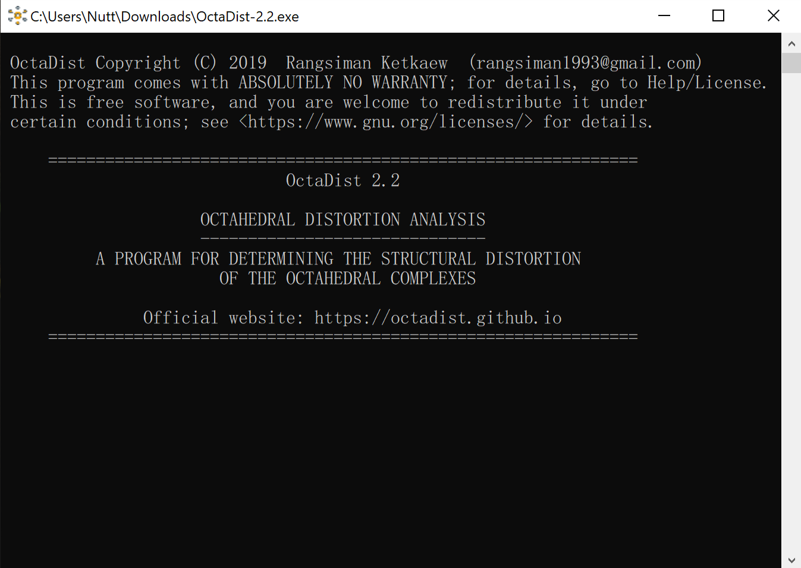
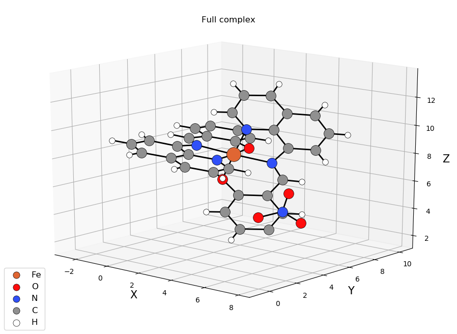
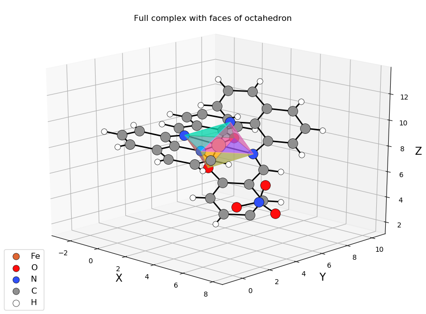
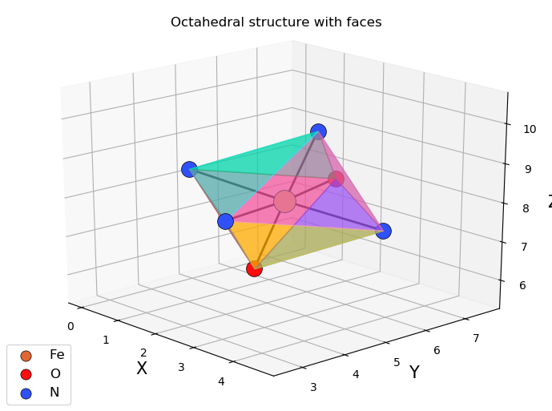
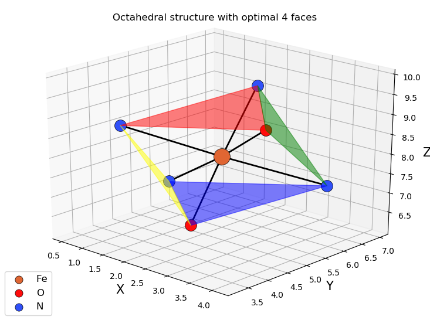

## OctaDist
OctaDist (**Octa**hedral **Dist**ortion Analysis) is a program for determining the structural distortion of the distorted octahedral complexes. OctaDist does compute the octahedral distortion parameters: , , and . These parameters have been widely used in inorganic chemistry and crystallography. For example, they are useful for tracking the structural change of spin-crossover complex when the electrocnics spin-state changing from low-spin to high-spin and vice versa. Even though the people in community generally compute the octahedral distortion parameters for their complexes, but they not used a certain way to do this. Moreover, there is no software for determining this kind of parameter yet. Therefore, we present the OctaDist program as a choice for those who are interested in this. [Click here to learn more about the OctaDist](./about.md)

## Release
[The release of OctaDist 2.2 (February 2019) is now available](https://github.com/OctaDist/OctaDist/releases/latest) 

## Installation
**Windows**
1. Download program executable `.exe`
2. Right click on program icon and select `Run as administrator`
3. Click `Yes`
4. Wait program for process until open

**macOS**
1. _Please wait for update_

**Linux**
1. Download the tarbal of program source code
2. Uncompress the tarball: `tar -xzvf OctaDist-*`
3. Enter OctaDist directory: `cd OctaDist-*/src`
4. Change file permission of all python files: `chmod +x *.py`
5. Execute program: `python3 main.py`

## Usage
**Supported input file format**
- [XYZ file format](https://en.wikipedia.org/wiki/XYZ_file_format) (*.xyz)
- Text file format (*.txt)
- Output file of several computational chemistry programs (*.out, *.log): Gaussian, NWChem, ORCA, and Q-Chem

[Click here for input preparation and testing examples](./testing.md)

## Screenshots
**Program GUI**

|            Program UI            |         Console window        |
|:--------------------------------:|:-----------------------------:|
|   | | 

**Display of full complex and selected octahedron**

|All atoms                         | Full complex with faces of octahedron  |
|:--------------------------------:|:--------------------------------------:|
|          |                |
|**Selected octahedral structure** | **Optimal 4 faces**                    |
|          |                |

## Citation
Please site this project when you use it for scientific publication.

```
OctaDist - A program for determining the structural distortion of the octahedral complexes.
https://octadist.github.io
```

## Development
### Architecture
OctaDist has been written in Python 3 binding to TkInter graphical interface and tested on PyCharm (Community Edition). Program executable was compiled by Pyinstaller. The program supports Windows, macOS, and Linux OS for both 32-bit and 64-bit systems

### Team
- [Rangsiman Ketkaew](https://sites.google.com/site/rangsiman1993) (Thammasat University, Thailand) 
  - E-mail: rangsiman1993@gmail.com
- [Yuthana Tantirungrotechai](https://sites.google.com/site/compchem403/people/faculty/yuthana) (Thammasat University, Thailand)
  - E-mail: yt203y@gmail.com
- [David J. Harding](https://www.funtechwu.com/david-j-harding) (Walailak University, Thailand)
  - E-mail: hdavid@mail.wu.ac.th
