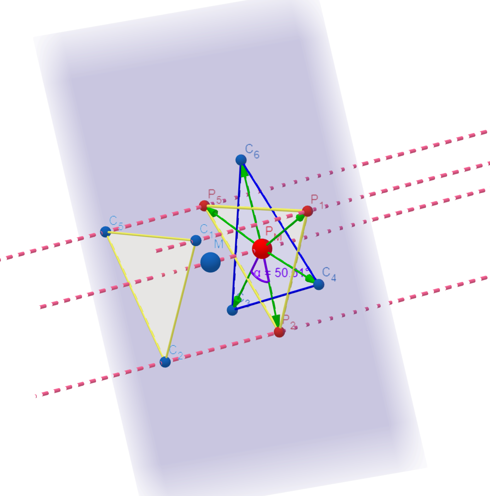

## Octahedral Distortion Parameters

[back to homepage](./)

Octahedral distortion parameters contain three parameters: , , and . The following just explains how to compute these three parameters, especially we use our new method to compute the  parameter. Please refer to [References](#references) for more details.

- Calculation of the  and  parameters are straightforward. The  is the avearge of the sum of the deviation of LG-M distance, where LG and M are ligand atom and metal center atom, from mean distance. The  is the sum of LG-M-LS angle (  ) from the 90 degree.

- The  parameter is the sum of the deviation of 24 unique LG-M-LG angles () from 60 degree, where  is computed on the orthogonal projection of two twisting triangular faces of the octahedron projected along its pseudo-threefold axes onto the medium plane that containing metal center. However, in reality, becuase of the complex is distorted, the symmetry is changed, so the medium plane between two opposite faces cannot be determined directly. To solve this, we propose a new method to find the optimal 4 faces and use orthogonal vector projection for computing the unique () angles on twisting triangular faces, and for finding the most reasonable  parameter.

Mathematical expression of three parameters are given by following equations

 

 

 

- To find the optimal 4 planes (faces), OctaDist firstly chooses 4 faces out of 8 faces of complex. The total number of combination is 70. Then OctaDist computes the 24 unique () angles for all 70 sets of planes and computes the 70 different values of  parameter. The lowest value is chosen as a minimum  parameter representing the distortion of the octahedral metal complex.

**Graphical representation of orthogonal projection and twisting triangular faces**

|Distorted octahedron | Orthogonal projection of atoms onto the given (opposite) plane | The  angle between the atom vectors defined by two twisting triangular faces|
|:-------------------------:|:-------------------------:|:-------------------------:|
| |  | |

 

[back to homepage](./)

