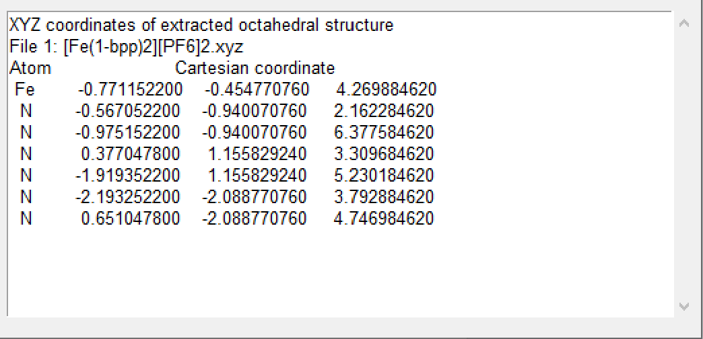
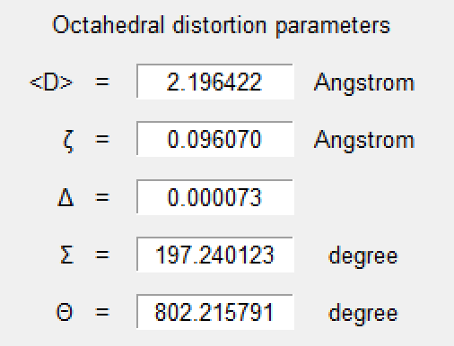

[back to homepage](./) | [manual](./manual.md)


## Running the test
***

This section shows how OctaDist can be used for computing the distortion parameters step by step.
OctaDist has two versions based on purpose of use: a graphical user interface (GUI) and command line interface (CLU).
The former is designed for the end-user who do not familiar with command lines, 
while the latter is for Linux (and Mac) users, especially the developer who want to implement OctaDist into their software.

Input examples can be found at [example-input](https://github.com/OctaDist/OctaDist.github.io/tree/master/example-input).

***

**Content**

- [OctaDist - GUI](#octadist---gui)
- [OctaDist - CLI](#octadist---cli)
- [Sample usage](#sample-usage)
    - [Example 1: Simple calculation 1](#example-1)
    - [Example 2: Simple calculation 2](#example-2)
    - [Example 3: Reading data from input file](#example-3)
    - [Example 4: Selecting the metal](#example-4)
    - [Example 5: Display molecule and save image](#example-5)

***

### OctaDist - GUI

1. Click **`Browse file`**, choose one or multiple input files, then click **`Open`**.

    <p align="center">
    
    <p/>
   
2. OctaDist will check file format and extract atomic coordinates, and show the data on a result box.

    <p align="center">
    
    <p/>

3. If yes, then click **`Compute`**.

    <p align="center">
    
    <p/>

4. The computed parameters will be shown in output box.

    <p align="center">
    
    <p/>

5. To save the results, click **`File`**, then **`Save results`**.

    <p align="center">
    
    <p/>

### OctaDist - CLI

Example scripts are available at [here](https://github.com/OctaDist/OctaDist-PyPI/tree/master/example-py).

1. Install OctaDist using  **`pip`** or **`conda`** (see [installing](installing.md) for details).

2. Prepare lists of atomic labels and coordinates of octahedral structure

    ```python
    atom = ['Fe', 'O', 'O', 'N', 'N', 'N', 'N']
    
    coor = [[2.298354000, 5.161785000, 7.971898000],
            [1.885657000, 4.804777000, 6.183726000],
            [1.747515000, 6.960963000, 7.932784000],
            [4.094380000, 5.807257000, 7.588689000],
            [0.539005000, 4.482809000, 8.460004000],
            [2.812425000, 3.266553000, 8.131637000],
            [2.886404000, 5.392925000, 9.848966000]]
    ```

    or you can use **`extract_octa`** method in **`coord`** module to open and read input file at the same time, it will also extract the octahedral structure from full complex.
    For example, input file **`full/path/of/input/file/Multiple-metals.xyz`**
    (other example input files are available at [here](https://github.com/OctaDist/OctaDist-PyPI/tree/master/example-input)):
    
    ```python
    from octadist import coord
    
    file = r"full/path/of/input/file/Multiple-metals.xyz"
    atom, coor = coord.extract_octa(file)
    ```
    
3.  Import **`calc`** module for computing the octahedral distortion parameters:
    
    ```python
    from octadist import calc
    ```
    
4.  Use **`calc_all`** method Calculate all octahedral parameters

    ```python
    d_mean, zeta, delta, sigma, theta = calc.calc_all(atom, coor)
    ```

5.  Print all computed parameters:
    
    ```python
    All computed parameters
    -----------------------
    Zeta  = 0.22807256171728651
    Delta = 0.0004762517834704151
    Sigma = 47.926528379270124
    Theta = 122.688972774546
    ```

### Sample usage
***

#### Example 1

[download code script](./example-py/example_1.py)

```python
###################################################
# Example 1 for running the test on OctaDist PyPI #
###################################################

from octadist import calc

# The first atom must be metal center atom of octahedral structure.
# If not, please see example_2.py for how to handle this issue.

atom = ['Fe', 'O', 'O', 'N', 'N', 'N', 'N']

coor = [[2.298354000, 5.161785000, 7.971898000],  # <- Metal atom
        [1.885657000, 4.804777000, 6.183726000],
        [1.747515000, 6.960963000, 7.932784000],
        [4.094380000, 5.807257000, 7.588689000],
        [0.539005000, 4.482809000, 8.460004000],
        [2.812425000, 3.266553000, 8.131637000],
        [2.886404000, 5.392925000, 9.848966000]]

zeta, delta, sigma, theta = calc.calc_all(coor)

print("\nAll computed parameters")
print("-----------------------")
print("Zeta  =", zeta)
print("Delta =", delta)
print("Sigma =", sigma)
print("Theta =", theta)

# All computed parameters
# -----------------------
# Zeta  = 0.22807256171728651
# Delta = 0.0004762517834704151
# Sigma = 47.926528379270124
# Theta = 122.688972774546
```

#### Example 2

[download code script](./example-py/example_2.py)

```python
###################################################
# Example 2 for running the test on OctaDist PyPI #
###################################################

from octadist import calc, coord

atom = ['O', 'O', 'Fe', 'N', 'N', 'N', 'N']

coor = [[1.885657000, 4.804777000, 6.183726000],
        [1.747515000, 6.960963000, 7.932784000],
        [2.298354000, 5.161785000, 7.971898000],  # <- Metal atom
        [4.094380000, 5.807257000, 7.588689000],
        [0.539005000, 4.482809000, 8.460004000],
        [2.812425000, 3.266553000, 8.131637000],
        [2.886404000, 5.392925000, 9.848966000]]

# What if the first atom in atomic symbol and coordinates lists are not metal atom,
# you can also use coord.extract_octa to rearrange the sequence of atom in list.

atom_octa, coor_octa = coord.extract_octa(atom, coor)

zeta, delta, sigma, theta = calc.calc_all(coor_octa)

print("\nAll computed parameters")
print("-----------------------")
print("Zeta  =", zeta)
print("Delta =", delta)
print("Sigma =", sigma)
print("Theta =", theta)

# All computed parameters
# -----------------------
# Zeta  = 0.22807256171728651
# Delta = 0.0004762517834704151
# Sigma = 47.926528379270124
# Theta = 122.688972774546
```

#### Example 3

[download code script](./example-py/example_3.py)

```python
###################################################
# Example 3 for running the test on OctaDist PyPI #
###################################################

from octadist import coord, calc

# You can also import your input file, like this:

file = r"../example-input/Multiple-metals.xyz"

# Then use coord.extract_file to extract all atomic symbols and coordinates,
# and then use coord.extract_octa for taking the octahedral structure.

atom_full, coor_full = coord.extract_file(file)
atom_octa, coor_octa = coord.extract_octa(atom_full, coor_full)

zeta, delta, sigma, theta = calc.calc_all(coor_octa)

print("\nAll computed parameters")
print("-----------------------")
print("Zeta  =", zeta)
print("Delta =", delta)
print("Sigma =", sigma)
print("Theta =", theta)

# All computed parameters
# -----------------------
# Zeta  = 0.0030146365519487794
# Delta = 1.3695007180404868e-07
# Sigma = 147.3168033970211
# Theta = 520.6407679851042
```

#### Example 4

[download code script](./example-py/example_4.py)

```python
###################################################
# Example 4 for running the test on OctaDist PyPI #
###################################################

from octadist import coord, calc

file = r"../example-input/Multiple-metals.xyz"

atom_full, coor_full = coord.extract_file(file)

# If complex contains metal center more than one, you can specify the index metal
# whose octahedral structure will be computed.
# For example, this complex contains three metal atoms: Fe, Ru, and Rd.
# I add "2" as a second argument for choosing Ru as metal of interest.

atom_octa, coor_octa = coord.extract_octa(atom_full, coor_full, 2)

zeta, delta, sigma, theta = calc.calc_all(coor_octa)

print("\nAll computed parameters")
print("-----------------------")
print("Zeta  =", zeta)
print("Delta =", delta)
print("Sigma =", sigma)
print("Theta =", theta)

# All computed parameters
# -----------------------
# Zeta  = 0.001616439510534251
# Delta = 3.5425830613072754e-08
# Sigma = 1.26579367508117
# Theta = 4.177042495798965
```

#### Example 5

[download code script](./example-py/example_5.py)

```python
###################################################
# Example 5 for running the test on OctaDist PyPI #
###################################################

from octadist import coord, draw

file = r"../example-input/Multiple-metals.xyz"

# Graphical display for octahedral complex

atom_full, coor_full = coord.extract_file(file)
draw.all_atom(atom_full, coor_full)

# Display and automatically save image as .png file with user-specified name

draw.all_atom(atom_full, coor_full, "complex_octadist")

# Output image, complex_octadist.png, is stored at ../images directory
```


[back to homepage](./) | [manual](./manual.md)
