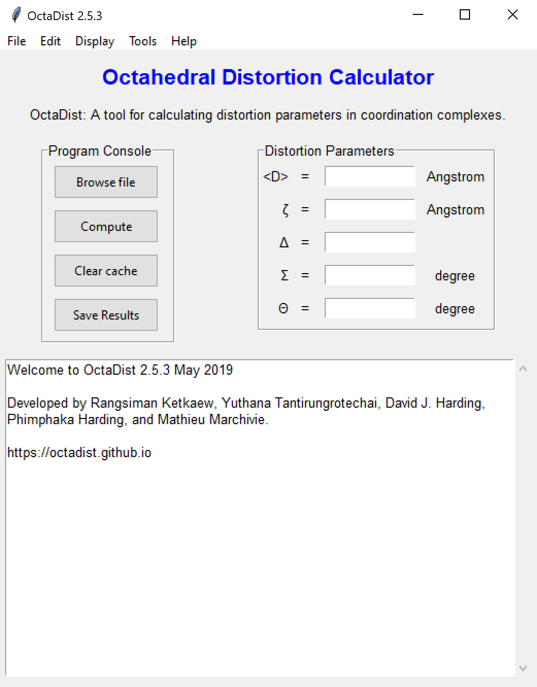
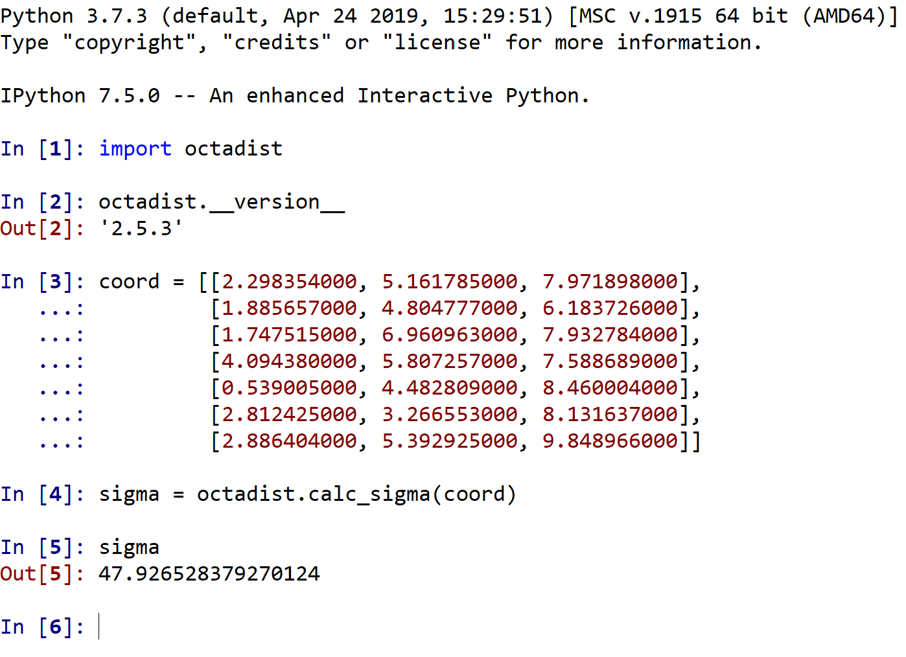

[back to homepage](./)

## Screenshots
***
### Program Interface

|         User Interface           | Using IPython for interactive work |
|:--------------------------------:|:----------------------------------:|
|   |      |

### Display of metal complexes and selected octahedral structures

|             All atoms            |    All atoms and faces of octahedron   |
|:--------------------------------:|:--------------------------------------:|
|          |                |
|**Selected octahedral structure** |       **Selected optimal 4 faces**     |
|          |                |

[back to homepage](./)
